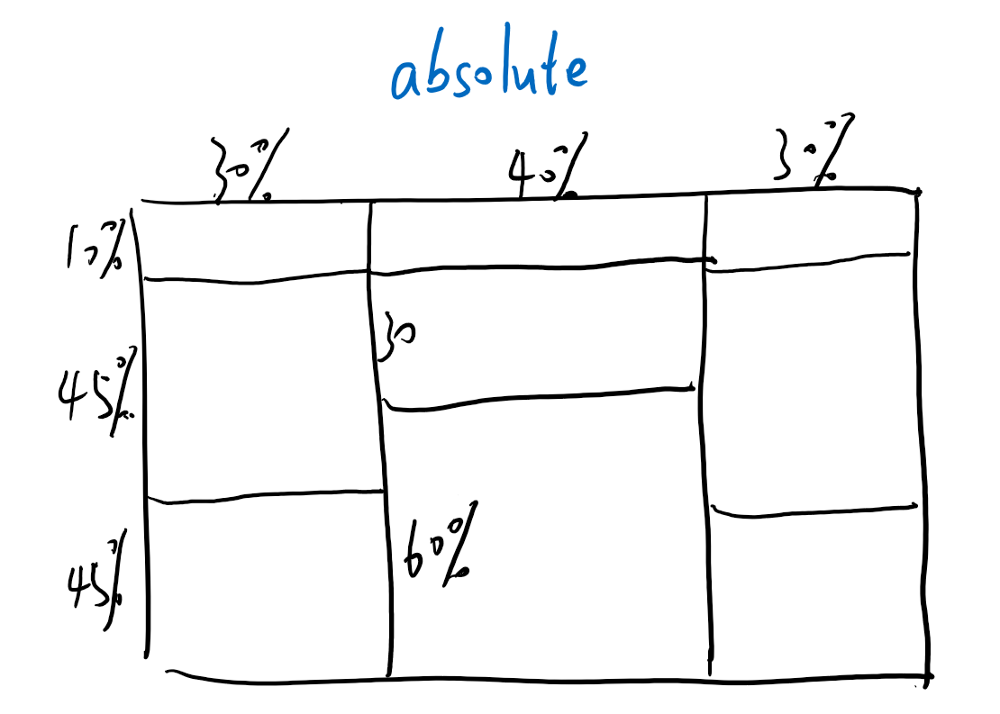

# Cov19 疫情可视化

使用Flask框架构建Web，爬取疫情信息进行可视化展示。

## 软件环境

PyCharm + python 3.8 + Flask

## 数据获取

* 疫情数据来自腾讯疫情数据，使用requests库进行爬取；
* 热搜来自百度热搜，使用selenium的无头模式进行爬取；
* 在MySQL中创建cov数据库，并创建history、details和hotsearch表；
* 利用pymysql在python中对数据表进行操作，插入数据。

## Flask框架设计

